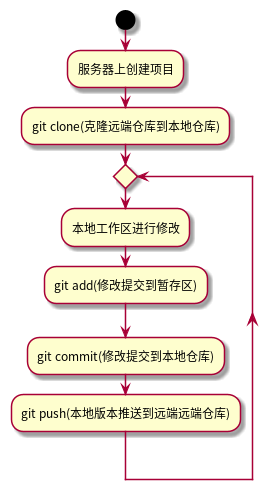
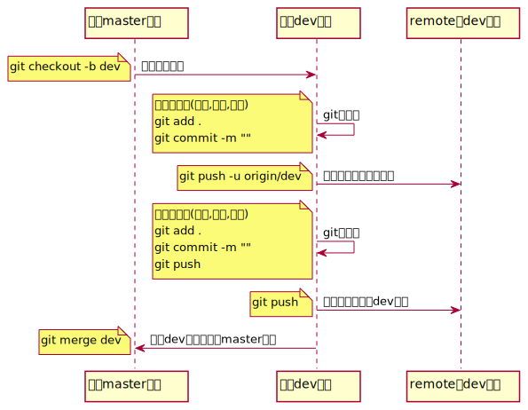

# Table of Contents

1.  [git 命令解释](#org685942f)
    1.  [git init](#orgb9f034c)
    2.  [git add](#org25793ac)
    3.  [git commit](#org9cfbf97)
    4.  [git remote](#org4834161)
    5.  [git push](#org7168f16)
    6.  [git pull](#orgd1c63fd)
    7.  [git fetch](#org784f3a7)
2.  [git简易实际操作流程](#orgf5cae33)
3.  [注册git服务](#org0dfd4f2)
4.  [git工具](#orgac51081)
    1.  [工具安装](#org9e84cd1)
    2.  [安装后的配置](#orgf6eed32)
5.  [git使用场景](#org96a053c)
    1.  [下载别人的仓库，不进行修改和提交](#orgb6fc03d)
    2.  [将自己的项目存放在服务器侧，并进行跟踪](#orgdb23203)
    3.  [分支(branch)的应用](#orgca3c28b)
        1.  [分支操作流程](#org38416a1)
        2.  [创建本地分支( `git checkout -b <本地分支名>` )](#org63614e5)
        3.  [查看所有分支( `git branch -a` )](#orge6f783b)
        4.  [在分支之前切换( `git branch <分支名>` )](#orgaa29b9a)
        5.  [删除本地分支( `git branch --delete <本地分支名>` )](#org8bc7ee1)
        6.  [分支的合并( `git merge` )](#orge58214a)
        7.  [创建远端分支/将本地分支推送到远端](#org8877193)
        8.  [删除远端分支( `git push --delete <远端名称> <远端分支名称>` )](#orgb22de62)

# git 命令解释

## git init

将当前目录放入git进行管理, 会在当前目录创建一个 `.git` 的隐藏文件夹

也就是说, 如果一个目录下面包含有 `.git` 文件夹, 则说明这个目录是被git管理的

如果你想要这个目录不再被git管理, 则只需要删除 `.git` 文件夹

## git add

`git add` 命令后面可以跟目录或者文件, 表示将这些文件和目录的变化添加到git的缓存中进行保存.

`git add` 的目的是保存文件的变化, 通常在git的根目录使用 `git add ./` 命令将该文件夹下的所有变化都加入git的缓存中.

## git commit

-   commit的作用是为当前已经add的内容打上一个标记, 用来标识一个阶段的工作.

-   commit后这些变化才算真正的放进了git仓库

-   commit的内容是从上次commit命令开始, 所有add的变化

-   commit必须要记录此次提交的内容的描述, 用以之后回顾和查找,

-   为了避免调用系统自带的编辑器进行commit消息的编写, 通常使用 `git commit -m "你想记录的工作内容"` 来进行commit操作. 这里面的 `-m` 是指的message.

## git remote

`git remote` 用来配置远端

-   `git remote -v`
    
    查看已经配置的远端信息
    
        ➜  preparatory-course git:(master) git remote -v
        gitee   git@gitee.com:linc5403/pre-course.git (fetch)
        gitee   git@gitee.com:linc5403/pre-course.git (push)
        origin  git@github.com:linc5403/preparatory-course.git (fetch)
        origin  git@github.com:linc5403/preparatory-course.git (push)

-   `git remote add`
    
    添加一个远端配置
    
        git remote add gitee https://gitee.com:linc5403/pre-course.git
    
    上述命令表示: 添加了一个远端, 名称为 `gitee`, 远端仓库地址为: `https://gitee.com:linc5403/pre-course.git`

-   `git remote remove`
    
    删除远端
    
        git remote remove origin
    
    上述命令表示删除名为 `origin` 的远端
    
    删除该远端后再使用 `git remote -v` 命令应该发现 `origin` 远端没有了

-   `git push`
    
    推送本地仓库的commit到远端
    
    第一次使用 `git push` 命令需要使用 `-u` 或者是 `--set-upstream` 信息将本地仓库和远端建立链接
    
    原因是上边的 `git remote add` 命令仅仅是添加了一个远端, 并没有指定本地和远端的对应关系
    
    第一次 `git push -u origin` 命令之后就就自动帮助我们将本地仓库和远端(origin)建立了映射关系, 后续再使用 `git push` 命令时则不需要使用 `-u` 选项了

-   `git branch -u`
    
    建立本地分支和远端的映射关系
    
    可以单独使用该命令为本地建立一个远端的映射
    
        ➜  preparatory-course git:(master) ✗ git branch -u origin/master
        Branch 'master' set up to track remote branch 'master' from 'origin'.
    
    这样就将本地的master分支关联到了origin/master分支, 后面使用 `git push` 时不需要指定 `-u` 也会自动推送到远端 `origin/master` 分支.

## git push

将本地的commit推送到远端

-   `git push -u origin`
    
    该命令在没有将本地和远端建立关联的时候使用, 作用是推送的同时, 将本地仓库和名为 `origin` 的远端建立连接, 这样操作一次之后, 下次推送时就会自动推送到 `origin` 这个远端.

-   推送失败的可能原因
    -   提示你没有权限
        
        检查你的用户名和密码是否是自己的(MAC钥匙串), 如果不是请将其删除, 再次push应该会提示你输入用户名和密码
    
    -   提示你需要先使用 `git pull`
        
        这种情况多数可能是因为该远端上的commit还未同步到你当前的这个本地仓库, 因此需要先使用 `git pull` 命令将远端上的commit拉取下来; 然后再使用 `git push` 命令. 如下例子所示:
        
            ➜  preparatory-course git:(master) git push
            To github.com:linc5403/preparatory-course.git
             ! [rejected]        master -> master (fetch first)
            error: failed to push some refs to 'git@github.com:linc5403/preparatory-course.git'
            hint: Updates were rejected because the remote contains work that you do
            hint: not have locally. This is usually caused by another repository pushing
            hint: to the same ref. You may want to first integrate the remote changes
            hint: (e.g., 'git pull ...') before pushing again.
            hint: See the 'Note about fast-forwards' in 'git push --help' for details.
            ➜  preparatory-course git:(master) git pull
            remote: Enumerating objects: 10, done.
            remote: Counting objects: 100% (9/9), done.
            remote: Compressing objects: 100% (3/3), done.
            remote: Total 6 (delta 3), reused 6 (delta 3), pack-reused 0
            Unpacking objects: 100% (6/6), 728 bytes | 145.00 KiB/s, done.
            From github.com:linc5403/preparatory-course
               18710ec..3097582  master     -> origin/master
            Already up to date!
            Merge made by the 'recursive' strategy.

## git pull

获取远端的引用, 并将远端的commit自动合并(merge)到本地工作区, 因此这个命令可能会出现 `VIM` 的窗口, 需要正确退出该窗口(多按几次Esc, 然后输入 `:q` )才能成功的完成pull操作.

## git fetch

获取远端的引用, 和 `git pull` 的区别在于 `git fetch` 命令并不会自动帮我们合并远端的变更到工作区, 你需要手动执行 `git merge` 命令.

# git简易实际操作流程

# 注册git服务

多家公司都提供了git服务，例如[github](https://github.com/), [gitlab](https://about.gitlab.com/), [码云](https://gitee.com/)等，首选需要选择一个服务提供商，并在其网站上注册账号，开通服务。
本文使用码云作为示例进行讲解。

# git工具

我们通常使用命令行来使用git，在不同操作系统下命令行都是一致的。

## 工具安装

-   MAC
    -   使用Xcode进行安装
        
        直接从AppStore安装Xcode，Xcode集成了Git，不过默认没有安装，你需要运行Xcode，选择菜单“Xcode”->“Preferences”，在弹出窗口中找到“Downloads”，选择“Command Line Tools”，点“Install”就可以完成安装了。
        
    
    -   直接安装git官方应用(推荐)
        
        [官方下载地址](https://git-scm.com/download/mac)
        
        注意如果没有安装brew可以直接下载二进制镜像文件进行安装
        
        

-   Windows
    在git官网下载[安装程序](https://git-scm.com/download/win)，然后按照默认选项进行安装。安装完成后，在开始菜单里找到“Git”->“Git Bash”，蹦出一个类似命令行窗口的东西，就说明Git安装成功！
    
    

-   Linux  
    不同的发行版本请使用不同的包管理器进行安装，[这个网页](https://git-scm.com/download/linux)有详细的介绍和说明。

## 安装后的配置

    $ git config --global user.name "Your Name"
    $ git config --global user.email "email@example.com"

这两条命令的作用是初始化你这台机器的全局git配置，包含用户名和Email，当你进行着两个配置之后，提交到仓库中的记录就可以看到你指定的用户名和Email地址。

注意 `git config` 命令的 `--global` 参数，用了这个参数，表示你这台机器上所有的Git仓库都会使用这个配置，当然也可以对某个仓库指定不同的用户名和Email地址。

# git使用场景

## 下载别人的仓库，不进行修改和提交

这种一般是借鉴和学习别人代码的场景，通常只需要一条命令就可以完成：

    git clone 远端地址

## 将自己的项目存放在服务器侧，并进行跟踪

下面使用gitee的具体实例来演示如何管理自己的项目:

1.  在服务器上创建项目
    
    在浏览器中打开[gitee](https://gitee.com/)，登录，点击右上角加号，选择“新建仓库"
    
    

2.  在新建仓库页面中填写“仓库名称”，注意“是否开源”的选项，如果想要其他人默认可以访问这个仓库应该选择“公开”。具体操作如图所示：
    
    
    
    点击下方的“创建”按钮，项目就创建好了。

3.  新建仓库会在这个页面中展示，需要记录下新仓库的地址，如下图所示：
    
    
4.  在命令行（终端）中进入你想要放置该仓库的目录，例如home目录，然后在运行 `git clone` 命令，将远端仓库克隆到本地：
    
    
    
    克隆完成后会在当前目录新建一个你的项目。

5.  在新的文件夹中进行修改，并使用 `git add` 命令提交到暂存区:
    
    

6.  使用 `git commit -m` 命令提交此次的变更：
    
    

7.  使用 `git push` 命令将版本推送到远端：
    
    注意，这一步需要输入你在 `gitee` 上的用户名和密码
    
    

8.  在网页上检查你的更新是否已经生效：
    
    

## 分支(branch)的应用

### 分支操作流程

### 创建本地分支( `git checkout -b <本地分支名>` )

使用 `git checkout -b <本地分支名>` 这条命令创建一个本地分支, 新的本地分支会是你当前执行命令时分支的一份拷贝.

该命令执行成功后, 会自动切换到你新创建的这个分支:

    ➜  preparatory-course git:(master) git checkout -b dev
    Switched to a new branch 'dev'
    ➜  preparatory-course git:(dev)

### 查看所有分支( `git branch -a` )

该命令的回显如下所示:

> -   dev
>     master
>     remotes/gitee/master
>     remotes/origin/master

-   其中带 `*` 的行表示你当前所属的分支

-   以 `remotes` 开始的行表示获取到的远端分支

### 在分支之前切换( `git branch <分支名>` )

注意该命令并没有带上 `-b` 选项, 表示切换到你输入的分支

    ➜  preparatory-course git:(master) git checkout dev
    Switched to branch 'dev'
    ➜  preparatory-course git:(dev) git checkout master
    Switched to branch 'master'
    Your branch is ahead of 'origin/master' by 3 commits.
      (use "git push" to publish your local commits)
    ➜  preparatory-course git:(master)

### 删除本地分支( `git branch --delete <本地分支名>` )

注意: 你不能删除当前所处的本地分支, 否则会报如下错误:

    ➜  preparatory-course git:(dev) git branch --delete dev
    error: Cannot delete branch 'dev' checked out at '/home/linc/courses/preparatory-course'
    ➜  preparatory-course git:(dev)

需要先切换到其他分支才能删除:

    ➜  preparatory-course git:(dev) git checkout master
    Switched to branch 'master'
    Your branch is ahead of 'origin/master' by 4 commits.
      (use "git push" to publish your local commits)
    ➜  preparatory-course git:(master) git branch --delete dev
    Deleted branch dev (was 623fa5d).

### 分支的合并( `git merge` )

通过 `git merge <branch-from>` 命令将 `<branch-from>` 的内容合并到当前所在的分支, 例如:

    ➜  temp git:(master) git merge dev
    Updating ba79bbf..d428dc7
    Fast-forward
     shell1.sh | 1 +
     1 file changed, 1 insertion(+)
    ➜  temp git:(master)

上述操作将本地的 `dev` 分支内容合并到当前的 `mater` 分支上

### 创建远端分支/将本地分支推送到远端

push时指定远端及分支名

    ➜  preparatory-course git:(dev) ✗ git push -u origin dev
    Enumerating objects: 12, done.
    Counting objects: 100% (12/12), done.
    Delta compression using up to 12 threads
    Compressing objects: 100% (10/10), done.
    Writing objects: 100% (10/10), 2.67 KiB | 683.00 KiB/s, done.
    Total 10 (delta 7), reused 0 (delta 0)
    remote: Resolving deltas: 100% (7/7), completed with 2 local objects.
    remote:
    remote: Create a pull request for 'dev' on GitHub by visiting:
    remote:      https://github.com/linc5403/preparatory-course/pull/new/dev
    remote:
    To github.com:linc5403/preparatory-course.git
     * [new branch]      dev -> dev
    Branch 'dev' set up to track remote branch 'dev' from 'origin'.

### 删除远端分支( `git push --delete <远端名称> <远端分支名称>` )

    ➜  preparatory-course git:(dev) ✗ git push --delete origin dev
    To github.com:linc5403/preparatory-course.git
     - [deleted]         dev

