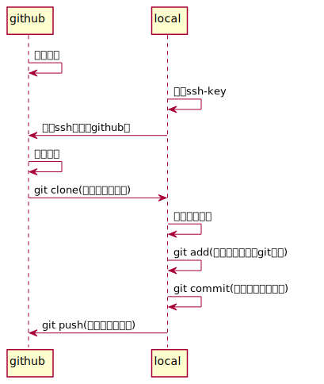

# Table of Contents

1.  [学习路线](#orge951f70)
2.  [预备课必备知识](#org70f6250)
    1.  [命令行操作](#org18d9e2e)
        1.  [linux文件和目录](#org8ca5e0c)
        2.  [其他重要命令](#org925790e)
        3.  [命令行快捷键](#orgac80382)
    2.  [Mac下的软件管理-`brew`](#orgd3e2e6d)
        1.  [install](#org8207c6b)
        2.  [修改源变快一点](#orgb1049cf)
        3.  [brew常用命令](#org1e2a1ec)
    3.  [编辑器](#orgc79f662)
    4.  [如何做笔记](#orgc22de01)
        1.  [有道云笔记](#orgff728a6)
        2.  [markdown语法](#org2d38a25)
        3.  [markdown编辑器-Typora](#orge5c164f)
    5.  [`git`](#org8b59a7d)
        1.  [git和github的关系说明](#orgb3ff6e4)
        2.  [`git` 的安装](#org72e99db)
        3.  [`github` 的使用](#org76fe16e)
        4.  [注意事项](#orgf26c653)

# 学习路线

# 预备课必备知识

[半圆的wiki参考](https://wiki.banyuan.club/pages/viewpage.action?pageId=3047612)

对同学们的要求：

> **1. 不懂就问**
> 
> **2. 自己在电脑上操作的每条命令，每个动作都要明白有什么样的效果**

## 命令行操作

> **重要**
> 
> 使用 `Tab` 键可以进行补全，加快你的操作。

### linux文件和目录

[文件权限与目录配置](http://cn.linux.vbird.org/linux_basic/0210filepermission.php)

[文件与目录管理](http://cn.linux.vbird.org/linux_basic/0220filemanager.php)

带着问题学习：

> 1.  Home目录是什么？
> 2.  `.` 和 `..` 以及 `~` 是什么？
> 3.  什么是隐藏文件
> 4.  如何创建文件夹，删除文件，删除文件夹，重命名或是移动文件

1.  `pwd`

    知道你现在的工作目录
    
        /Users/banyuan/preparatory-course
        /->Users->banyuan->preparatory-course

2.  `cd`

    (change directory)切换工作目录
    
    不加参数 表示切换到home目录
    
    带1个参数 切换到你指定的参数目录
    
    <table border="2" cellspacing="0" cellpadding="6" rules="groups" frame="hsides">
    
    
    <colgroup>
    <col  class="org-left" />
    
    <col  class="org-left" />
    </colgroup>
    <thead>
    <tr>
    <th scope="col" class="org-left">符号</th>
    <th scope="col" class="org-left">含义</th>
    </tr>
    </thead>
    
    <tbody>
    <tr>
    <td class="org-left">.</td>
    <td class="org-left">当前目录</td>
    </tr>
    
    
    <tr>
    <td class="org-left">..</td>
    <td class="org-left">上一级目录</td>
    </tr>
    
    
    <tr>
    <td class="org-left">-</td>
    <td class="org-left">之前的工作目录</td>
    </tr>
    
    
    <tr>
    <td class="org-left">～</td>
    <td class="org-left">home目录</td>
    </tr>
    </tbody>
    </table>

3.  `ls`

    (list)查看指定目录下的文件和文件夹
    
    <table border="2" cellspacing="0" cellpadding="6" rules="groups" frame="hsides">
    
    
    <colgroup>
    <col  class="org-left" />
    
    <col  class="org-left" />
    </colgroup>
    <thead>
    <tr>
    <th scope="col" class="org-left">命令</th>
    <th scope="col" class="org-left">作用</th>
    </tr>
    </thead>
    
    <tbody>
    <tr>
    <td class="org-left">ls -a</td>
    <td class="org-left">all, 查看所有文件和文件夹（包含隐藏文件和文件夹）</td>
    </tr>
    
    
    <tr>
    <td class="org-left">ls -l</td>
    <td class="org-left">long, 查看详细属性</td>
    </tr>
    
    
    <tr>
    <td class="org-left">ls -h</td>
    <td class="org-left">humanity, 友好方式显示</td>
    </tr>
    </tbody>
    </table>

4.  文件操作

    <table border="2" cellspacing="0" cellpadding="6" rules="groups" frame="hsides">
    
    
    <colgroup>
    <col  class="org-left" />
    
    <col  class="org-left" />
    </colgroup>
    <tbody>
    <tr>
    <td class="org-left">命令</td>
    <td class="org-left">作用</td>
    </tr>
    
    
    <tr>
    <td class="org-left">touch</td>
    <td class="org-left">新创建一个文件</td>
    </tr>
    
    
    <tr>
    <td class="org-left">rm</td>
    <td class="org-left">(remove) 删除一个文件</td>
    </tr>
    
    
    <tr>
    <td class="org-left">cp</td>
    <td class="org-left">(copy) 复制一个文件</td>
    </tr>
    
    
    <tr>
    <td class="org-left">mv</td>
    <td class="org-left">(move) 移动一个文件</td>
    </tr>
    </tbody>
    </table>

5.  目录操作

    <table border="2" cellspacing="0" cellpadding="6" rules="groups" frame="hsides">
    
    
    <colgroup>
    <col  class="org-left" />
    
    <col  class="org-left" />
    </colgroup>
    <tbody>
    <tr>
    <td class="org-left">命令</td>
    <td class="org-left">作用</td>
    </tr>
    
    
    <tr>
    <td class="org-left">mkdir</td>
    <td class="org-left">新创建一个文件夹</td>
    </tr>
    
    
    <tr>
    <td class="org-left">rm -r</td>
    <td class="org-left">(remove) 删除一个文件夹</td>
    </tr>
    
    
    <tr>
    <td class="org-left">cp -r</td>
    <td class="org-left">(copy) 复制一个文件夹</td>
    </tr>
    
    
    <tr>
    <td class="org-left">mv</td>
    <td class="org-left">(move) 移动一个文件夹</td>
    </tr>
    </tbody>
    </table>

6.  文件操作命令汇总

    <table border="2" cellspacing="0" cellpadding="6" rules="groups" frame="hsides">
    
    
    <colgroup>
    <col  class="org-left" />
    
    <col  class="org-left" />
    </colgroup>
    <thead>
    <tr>
    <th scope="col" class="org-left">文件操作命令</th>
    <th scope="col" class="org-left">作用</th>
    </tr>
    </thead>
    
    <tbody>
    <tr>
    <td class="org-left">ls</td>
    <td class="org-left">查看目录下的文件和文件夹</td>
    </tr>
    
    
    <tr>
    <td class="org-left">ls -l</td>
    <td class="org-left">long选项，显示更多的信息</td>
    </tr>
    
    
    <tr>
    <td class="org-left">ls -a</td>
    <td class="org-left">显示隐藏文件和文件夹</td>
    </tr>
    
    
    <tr>
    <td class="org-left">cd 文件夹</td>
    <td class="org-left">change dir（切换工作目录）</td>
    </tr>
    
    
    <tr>
    <td class="org-left">cd ..</td>
    <td class="org-left">切换到父目录</td>
    </tr>
    
    
    <tr>
    <td class="org-left">cd</td>
    <td class="org-left">不带参数切换到Home目录</td>
    </tr>
    
    
    <tr>
    <td class="org-left">cd -</td>
    <td class="org-left">切换到之前的工作目录</td>
    </tr>
    
    
    <tr>
    <td class="org-left">pwd</td>
    <td class="org-left">print work dir（打印当前的工作目录）</td>
    </tr>
    
    
    <tr>
    <td class="org-left">mkdir</td>
    <td class="org-left">创建一个目录</td>
    </tr>
    
    
    <tr>
    <td class="org-left">mkdir -p</td>
    <td class="org-left">创建多层目录</td>
    </tr>
    
    
    <tr>
    <td class="org-left">rm</td>
    <td class="org-left">remove(删除普通文件）</td>
    </tr>
    
    
    <tr>
    <td class="org-left">rm -rf</td>
    <td class="org-left">删除文件夹及其下面的所有文件</td>
    </tr>
    
    
    <tr>
    <td class="org-left">cp</td>
    <td class="org-left">copy(拷贝文件)</td>
    </tr>
    
    
    <tr>
    <td class="org-left">cp -r</td>
    <td class="org-left">拷贝文件夹</td>
    </tr>
    
    
    <tr>
    <td class="org-left">mv</td>
    <td class="org-left">move重命名文件/文件夹或是移动文件/文件夹</td>
    </tr>
    
    
    <tr>
    <td class="org-left">touch</td>
    <td class="org-left">创建一个空文件</td>
    </tr>
    </tbody>
    </table>

### 其他重要命令

1.  `history`
    查看历史命令记录
2.  `cat`
    查看文本文件内容
3.  `grep`
    过滤内容

### 命令行快捷键

<table border="2" cellspacing="0" cellpadding="6" rules="groups" frame="hsides">

<colgroup>
<col  class="org-left" />

<col  class="org-left" />
</colgroup>
<thead>
<tr>
<th scope="col" class="org-left">按键</th>
<th scope="col" class="org-left">作用</th>
</tr>
</thead>

<tbody>
<tr>
<td class="org-left">C-a</td>
<td class="org-left">光标移动到行首</td>
</tr>

<tr>
<td class="org-left">C-e</td>
<td class="org-left">光标移动到行尾</td>
</tr>

<tr>
<td class="org-left">C-f</td>
<td class="org-left">光标右移一个字符</td>
</tr>

<tr>
<td class="org-left">C-b</td>
<td class="org-left">光标左移一个字符</td>
</tr>

<tr>
<td class="org-left">M-f</td>
<td class="org-left">光标右移一个单词</td>
</tr>

<tr>
<td class="org-left">M-b</td>
<td class="org-left">光标左移一个单词</td>
</tr>

<tr>
<td class="org-left">C-d</td>
<td class="org-left">删除光标下的字符</td>
</tr>

<tr>
<td class="org-left">M-d</td>
<td class="org-left">删除光标右边的单词</td>
</tr>

<tr>
<td class="org-left">C-w</td>
<td class="org-left">删除光标左边的单词</td>
</tr>

<tr>
<td class="org-left">C-k</td>
<td class="org-left">删除光标右边的所有内容</td>
</tr>

<tr>
<td class="org-left">C-u</td>
<td class="org-left">删除整行内容</td>
</tr>

<tr>
<td class="org-left">C-p</td>
<td class="org-left">上一条执行的命令</td>
</tr>

<tr>
<td class="org-left">C-n</td>
<td class="org-left">下一条执行的命令（需要先执行C-p才可使用）</td>
</tr>

<tr>
<td class="org-left">C-r</td>
<td class="org-left">搜索之前执行的命令</td>
</tr>
</tbody>
</table>

## Mac下的软件管理-`brew`

[官网](https://brew.sh/)

### install

    /bin/bash -c "$(curl -fsSL https://raw.githubusercontent.com/Homebrew/install/master/install.sh)"

### 修改源变快一点

[参考1](https://lug.ustc.edu.cn/wiki/mirrors/help/brew.git)

[参考2](https://lug.ustc.edu.cn/wiki/mirrors/help/homebrew-bottles)

    # 替换brew.git:
    cd "$(brew --repo)"
    git remote set-url origin https://mirrors.ustc.edu.cn/brew.git
    
    # 替换homebrew-core.git:
    cd "$(brew --repo)/Library/Taps/homebrew/homebrew-core"
    git remote set-url origin https://mirrors.ustc.edu.cn/homebrew-core.git

### brew常用命令

<table border="2" cellspacing="0" cellpadding="6" rules="groups" frame="hsides">

<colgroup>
<col  class="org-left" />

<col  class="org-left" />
</colgroup>
<thead>
<tr>
<th scope="col" class="org-left">命令</th>
<th scope="col" class="org-left">作用</th>
</tr>
</thead>

<tbody>
<tr>
<td class="org-left">brew list</td>
<td class="org-left">查看已经安装的软件</td>
</tr>

<tr>
<td class="org-left">brew install</td>
<td class="org-left">安装软件</td>
</tr>

<tr>
<td class="org-left">brew uninstall</td>
<td class="org-left">卸载软件</td>
</tr>

<tr>
<td class="org-left">brew search</td>
<td class="org-left">查询可供安装的软件</td>
</tr>
</tbody>
</table>

## 编辑器

所有编辑相关的操作都尽量只在编辑器中完成，不需要鼠标和触摸板的操作

不管你使用什么编辑器，必须熟悉的快捷键操作包括：

1.  打开文件，关闭文件
2.  光标移动
3.  删除一行，删除一个词
4.  复制粘贴

选择一个适合你的编辑器:

-   sublime
    
    <https://www.sublimetext.com/>

-   Atom
    
    <https://atom.io/>

-   Visual Studio Code （VS-Code）
    
    <https://code.visualstudio.com/>

-   vim
-   emacs

## 如何做笔记

<https://wiki.banyuan.club/pages/viewpage.action?pageId=3052629>

### 有道云笔记

### markdown语法

[参考](https://wizardforcel.gitbooks.io/markdown-simple-world/2.html)

### markdown编辑器-Typora

## `git`

### git和github的关系说明

### `git` 的安装

参看下面的教程：

<https://wiki.banyuan.club/pages/viewpage.action?pageId=13700569>

### `github` 的使用

1.  创建账号(github网站操作)

    <https://github.com/join>

2.  配置 `ssh-key` （github网站操作)

    配置 `ssh-key` 的目的是为了使用 `ssh` 方式和 `github` 服务器建立连接，这样就不用输入用户名和密码。
    
    这个步骤的思路是： a. 配置本机的 `ssh-key` ； b. 将本机的 `ssh-key` 的公钥配置在 `github` 上。下面是具体操作：
    
    1.  删除别人的 `ssh-key`
        
        > **注意**
        > 
        > 如果你明白 `ssh-key` 是什么，而且确认这台电脑现在的 `ssh-key` 是你自己生成的，请不做这一步操作。
        
            rm -f ~/.ssh/id_rsa*
    2.  打开终端，输入这条命令：
        
            ssh-keygen -t rsa -b 4096 -C "your_email@example.com"
        
        > **注意**
        > 
        > -   命令里面双引号的内容修改成你自己的邮箱
        > -   该命令会有提示，一路回车就可以了
    3.  到这里，你本地的 `ssh-key` 就创建好了，需要将它放到 `github` 上
        
        终端里通过 `cat` 命令显示 ssh 公钥的内容：
        
            cat ~/.ssh/id_rsa.pub
        
        将下图中框内的内容都复制出来：
        
        
    
    4.  使用注册申请好的账号和密码登陆你的 `github`
    
    5.  选择你的头像右边的下拉框（在网页的右上方）
        
        
    6.  选择如下的 `SSH and GPG keys`
        
        
    
    7.  选中右上角的 `New SSH Key`
        
        
    
    8.  将第3)步你复制的内容粘贴进去，再补充一个标题：
        
        
    
    9.  最后一步，验证你是否完成了配置
        
            ssh -T git@github.com
        
        如果看到类似下面的 `successfully` 什么的，而且把你github的账号打印出来，则表示你成功了
        
            linc@pop-os:~/agenda$ ssh -T git@github.com
            Hi linc5403! You've successfully authenticated, but GitHub does not provide shell access.

3.  创建项目（github网站操作）

    1.  来到github的首页，并登陆，选择左侧 `Repositories` 右边的那个 `New`:
        
        
    
    2.  在创建项目的页面填好 `Repository Name` ，点击 `Create repository` 按钮，项目就创建好了。
        
        
    
    3.  在上一步已经在 `github` 服务器上创建好了远程项目，接下来需要将它同步到你的本地。
        
        你们需要重点看下面这张图：
        
        

4.  项目管理(本机操作)

    项目管理的流程如下：
    
    
    
    1.  `git clone`
        
        `git clone` 命令会在当前目录下下载远端的项目,例如：
        
        -   先找到 `git` 仓库的地址，创建项目的最后一步：
            
            
        
        -   使用 `git clone` 将它下载下来：
            
                git clone git@github.com:linc5403/for_git_demo.git
            
            会将远端 `for_git_demo.git` 仓库下载下来，在当前目录下新创建目录名为 `for_git_demo` 的目录:
            
            
            
            进入 `for_git_demo` 目录后，可以看到其中有 `.git` 的隐藏文件夹；说明 `git` 仓库已经建立好了。
    
    2.  `git add`
        
        当你对本地文件作了修改后，应当使用 `git add` 命令将你的变更告知git，此时可以缓存你的变更。
        
        让我们在 `for_git_demo` 目录中新建一个README.md文件，并将它添加到git中:
        
            linc@pop-os:~/for_git_demo$ echo "#this is my first git repo" >> README.md
            linc@pop-os:~/for_git_demo$ git status
            On branch master
            
            No commits yet
            
            Untracked files:
              (use "git add <file>..." to include in what will be committed)
            
            	README.md
            
            nothing added to commit but untracked files present (use "git add" to track)
            linc@pop-os:~/for_git_demo$ git add README.md
    
    3.  `git commit`
        
        当你的变更可以固定下来后，应当使用 `git commit` 命令将变更固化下来，同时需要描述此次变更的内容，方便今后快速查找。
        
        > **重要**
        > 
        > 当你还不会使用命令行编辑器的时候，最好使用 `git commit -m “你想说的话"` 这种方式来进行提交
        
            linc@pop-os:~/for_git_demo$ git commit -m "init repo"
            [master (root-commit) 2c902a3] init repo
             1 file changed, 1 insertion(+)
             create mode 100644 README.md
    
    4.  `git push`
        
        将你的本地项目同步到服务器，就不怕工作丢失了。
        
            linc@pop-os:~/for_git_demo$ git push
            Enumerating objects: 3, done.
            Counting objects: 100% (3/3), done.
            Writing objects: 100% (3/3), 234 bytes | 234.00 KiB/s, done.
            Total 3 (delta 0), reused 0 (delta 0)
            To github.com:linc5403/for_git_demo.git
             * [new branch]      master -> master

### 注意事项

1.  确认你的 `home` 目录下没有 `.git` 文件夹:
    
    在终端上运行这两条命令：
    
        cd ~
        ls -la | grep "\.git"
    
    如果有类似下面的回显：
    
        drwxr-xr-x  8 linc linc  4096 Mar 13 08:29 .git
    
    说明你的 `home` 目录被上一个同学放到了 `git` 中进行管理，请删除这个文件夹：
    
        rm -rf ~/.git

2.  修改自己提交git的用户名和邮箱
    
        git config --list
    
    此时会有类似这样的显示：
    
        user.name=lin chuan
        user.email=linch1982@gmail.com
        core.quotepath=false
    
    如果出现的username和email不是你想要的，请使用如下命令进行修改:
    
        git config --global user.name "你的名字,最好用英文字母"
        git config --global user.email "你的邮箱地址"
    
    > **注意** 上面两条 `config` 命令中的双引号不要省略

3.  如果你的git命令回显中出现中文的乱码
    
    使用下面这条命令进行修正：
    
        git config --global core.quotepath false

4.  你可以随时使用 `git status` 命令查看git的状态

5.  使用 `.gitignore` 来管理哪些文件/文件夹进入 `git`

