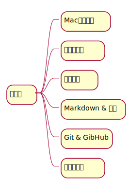
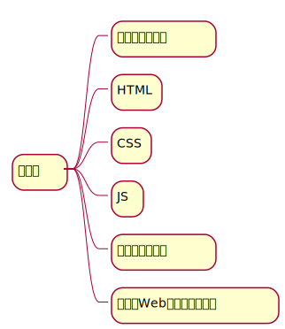
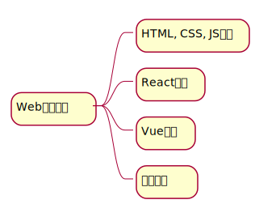
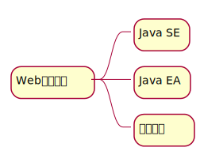

# Table of Contents

1.  [必备知识](#org87265b7)
2.  [前端](#orgd8ee07c)
3.  [后端](#orge117227)
4.  [devops](#org6c6f936)
5.  [学习路线](#org3e48564)
    1.  [预备课](#org71d900c)
    2.  [基础课](#orgdb1178b)
    3.  [Web前端](#orge42625d)
    4.  [Web后端](#org009d05a)

# 必备知识

# 前端

# 后端

# devops

# 学习路线

## 预备课

## 基础课

## Web前端

## Web后端

