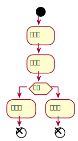

# Table of Contents

1.  [必备知识](#orgd2b4075)
2.  [前端](#org06e7d26)
3.  [后端](#org9835319)
4.  [devops](#org2ef27fe)
5.  [学习路线](#org5fde25b)
    1.  [预备课](#orgb9ae6e6)
    2.  [基础课](#org89de08f)
    3.  [Web前端](#orgfe703c1)
    4.  [Web后端](#orgeb4321b)

# 必备知识

# 前端

# 后端

# devops

# 学习路线

## 预备课

## 基础课

## Web前端

## Web后端

